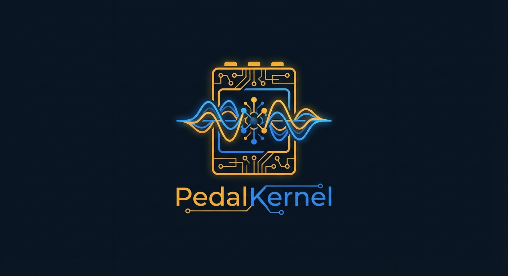

<div align="center">
  
  <h1>PedalKernel</h1>
  <p><strong>Real components. Real circuits. Real tone.</strong></p>
  <p>Write a schematic in <code>.pedal</code> files. Hear it. Build it.</p>

  [](https://www.rust-lang.org/)
  [](https://jackaudio.org/)
  [](https://opensource.org/licenses/MIT)
</div>

---

PedalKernel is a circuit-to-audio compiler. You describe a pedal the way you'd draw it on a napkin -- resistors, caps, diodes, tubes, pots, with real values and real wiring -- and PedalKernel compiles it into a real-time audio engine using Wave Digital Filters.

The same `.pedal` file exports to KiCad for PCB layout and generates a Mouser bill of materials. Design the tone first, then solder it.

## What it sounds like

Every component shapes the sound the way the physical part would. A 220nF cap in the feedback loop rolls off differently than a 100nF. Germanium diodes clip softer than silicon. A 12AX7 saturates differently than a 12AU7. There are no "models" or "algorithms" to choose from -- just the circuit.

```
pedal "Tube Screamer" {
  components {
    R1: resistor(4.7k)       # These values are the tone
    C1: cap(220n)             # Change them and the sound changes
    D1: diode_pair(silicon)   # Si clips harder than Ge
    Gain: pot(500k)
  }
  nets {
    in -> C1.a
    C1.b -> R1.a, D1.a
    D1.b -> gnd
    R1.b -> Gain.a
    Gain.b -> out
  }
  controls {
    Gain.position -> "Drive" [0.0, 1.0] = 0.5
  }
}
```

```
pedal "Fuzz Face" {
  components {
    C1: cap(2.2u)             # Big input cap = full bass into the fuzz
    R1: resistor(33k)
    R2: resistor(8.2k)
    Q1: pnp()                 # Germanium PNP pair
    Q2: pnp()
    C2: cap(10u)
    R3: resistor(100k)
    Fuzz: pot(1k)
    Volume: pot(500k)
  }
  nets {
    in -> C1.a
    C1.b -> Q1.base
    vcc -> R1.a
    R1.b -> Q1.collector, R2.a
    R2.b -> Q2.base
    Q1.emitter -> Fuzz.a
    Fuzz.b -> gnd
    Q2.collector -> R3.a
    R3.b -> gnd
    Q2.emitter -> vcc
    Q2.collector -> C2.a
    C2.b -> Volume.a
    Volume.b -> out
  }
  controls {
    Fuzz.position -> "Fuzz" [0.0, 1.0] = 0.7
    Volume.position -> "Volume" [0.0, 1.0] = 0.5
  }
}
```

## Components

Everything you'd find on a pedal builder's bench:

| Component | Syntax | What it does to the sound |
|-----------|--------|--------------------------|
| Resistor | `resistor(4.7k)` | Sets impedance, biasing, gain structure |
| Capacitor | `cap(220n)` | Frequency-dependent -- shapes the EQ curve |
| Inductor | `inductor(100m)` | Wah-style resonant peaks |
| Diode pair | `diode_pair(silicon\|germanium\|led)` | Symmetric clipping -- the core of overdrive |
| Single diode | `diode(silicon\|germanium\|led)` | Asymmetric clipping -- fuzz character |
| Potentiometer | `pot(500k)` | Variable resistance, bound to knobs |
| BJT | `npn()` / `pnp()` | Gain stages, biasing networks |
| Op-amp | `opamp()` | Clean gain, buffering |
| N-JFET | `njfet(j201\|2n5457)` | Voltage-controlled resistance (tremolo, compression) |
| P-JFET | `pjfet(2n5460)` | Complementary modulation |
| Vactrol | `photocoupler(vtl5c3\|vtl5c1\|nsl32)` | Optical compression, smooth envelope following |
| Triode | `triode(12ax7\|12at7\|12au7)` | Tube saturation -- plate starve to full breakup |
| LFO | `lfo(sine, 10k, 100n)` | Modulation source from physical RC timing |
| Envelope follower | `envelope_follower(10k, 100n, 100k, 1u, 47k)` | Dynamics-reactive modulation from RC networks |

### Engineering notation

`100p` = 100 pF, `220n` = 220 nF, `2.2u` = 2.2 uF, `100m` = 100 mH, `4.7k` = 4.7 kOhm, `1M` = 1 MOhm

### Wiring

Signal flow uses `->`. Comma-separated pins at a junction are electrically connected:

```
in -> C1.a              # Signal enters the coupling cap
C1.b -> R1.a, D1.a      # Cap output goes to both the resistor and diode
D1.b -> gnd              # Diode clips to ground
```

Reserved nodes: `in`, `out`, `gnd`, `vcc`

### Controls

Map physical pot positions to named knobs:

```
Gain.position -> "Drive" [0.0, 1.0] = 0.5
```

---

## Quick start

```bash
git clone https://github.com/ajmwagar/pedalkernel
cd pedalkernel
cargo build --release
cargo test

# Render to WAV -- listen to the circuit
cargo run --example overdrive
cargo run --example fuzzface

# Parse any .pedal file
cargo run --example parse_pedal -- examples/big_muff.pedal

# Export KiCad netlist for PCB layout
cargo run --example parse_pedal -- examples/klon_centaur.pedal

# Compare diode clipping: silicon vs germanium vs LED
cargo run --example direct_wdf

# Interactive TUI -- tweak knobs in real time
cargo run --example tui --features tui -- examples/tube_screamer.pedal
```

---

## From tone to PCB

The same `.pedal` file drives three outputs:

```
                          +---> WDF audio engine ---> WAV / JACK real-time
                          |
  .pedal file ---> parse -+---> KiCad netlist ---> PCB layout
                          |
                          +---> Bill of Materials ---> Mouser order
```

### KiCad export

Every component maps to a real KiCad symbol. Triodes get `Valve:ECC83`/`ECC81`/`ECC82`. JFETs get `Device:Q_NJFET_DGS`. Nets are preserved exactly. Open the `.net` file in KiCad and start laying out copper.

### Bill of materials

The BOM engine maps your circuit to real parts from a curated database -- Yageo metal film resistors, WIMA film caps, Nichicon electrolytics, Alpha pots, JJ Electronic tubes. Upload the CSV directly to Mouser:

```rust
let bom = pedalkernel::hw::build_bom(&pedal, None);
print!("{}", pedalkernel::hw::format_bom_table(&pedal.name, &bom, 1));
// -> Mouser P/Ns, quantities, descriptions, ready to order
```

### Hardware specs (`.pedalhw` files)

For builders who need to know if a part will survive the voltage. Declare real specs alongside your circuit:

```
# fuzz_face.pedalhw
Q1: vce_max(32) part("AC128")
Q2: vce_max(32) part("AC128")
C2: voltage_rating(16)
```

Run voltage compatibility checks before you power anything up:

```rust
let warnings = pedalkernel::hw::check_voltage_with_specs(&pedal, 18.0, &limits);
// [Danger] Q1: Germanium transistor exceeds Vce(max) 32V at 18V
// [Info]   V1: Tube needs 150-400V plate supply; at 18V the WDF model
//              runs fine but a physical build needs a B+ supply
```

Without a `.pedalhw` file, heuristic checks still catch obvious problems -- germanium transistors in fuzz circuits above 12V, undersized electrolytic caps, tubes at pedal voltages.

---

## TUI control surface

Tweak any `.pedal` file as an interactive ASCII pedalboard:

```bash
cargo run --example tui --features tui -- examples/tube_screamer.pedal
```

```
+--------------------------------------+
|          TUBE SCREAMER               |
|                                      |
|      .---.          .---.           |
|     /  |  \        /     \          |
|    |   |   |      |     \ |          |
|     \     /        \     /          |
|      '---'          '---'           |
|    >>Drive<<         Level           |
|       0.50           0.80            |
|                                      |
|            .----------.              |
|            |  ACTIVE  |              |
|            '----------'              |
|                                      |
|  <-> adjust  ^v fine  Tab next  Q quit|
+--------------------------------------+
```

Works with any pedal file. `big_muff.pedal` gives you three knobs. The control surface shapes to whatever you wire up.

---

## Supply voltage

Pedals run at 9V by default. Crank it to 12V or 18V for more headroom -- the WDF engine models how the active elements respond to higher rail voltage. The clipping threshold shifts, the gain stages swing further before saturating, the whole feel opens up. Just like plugging a real Tube Screamer into an 18V adapter.

```rust
proc.set_supply_voltage(12.0);  // More headroom, cleaner clipping
proc.set_supply_voltage(18.0);  // Even more -- like a Voodoo Lab Pedal Power
```

---

## How it works

The compiler transforms your circuit into a Wave Digital Filter tree:

1. **Circuit graph** -- Union-Find merges connected pins into nodes. Components become edges.

2. **Nonlinear root identification** -- BFS from the input finds diodes, JFETs, and triodes. Each becomes a WDF root. Its neighboring passives form the WDF tree.

3. **Series-parallel decomposition** -- The passive subgraph around each nonlinear element reduces into a binary tree of Series and Parallel adaptors.

4. **Impedance balancing** -- A raw voltage source (Rp=1) in parallel with a 100k resistor would attenuate the signal to nothing. The compiler adjusts Vs port resistance to match its sibling, giving balanced gamma for efficient signal transfer.

5. **Per-sample processing** -- Four phases, zero allocation:
   - Scatter up: leaves to root (reflected waves propagate)
   - Root solve: Newton-Raphson on the nonlinear element (Shockley equation for diodes, Koren equation for triodes)
   - Scatter down: root to leaves (incident waves propagate)
   - State update: capacitors and inductors latch

### Compiled Big Muff topology

Two cascaded clipping stages. Each diode pair gets its own WDF tree:

```
Stage 1:                          Stage 2:
   [DiodePair D1]                    [DiodePair D2]
         |                                 |
   ParallelAdaptor                   ParallelAdaptor
    /          \                      /          \
  Series      R1(10k)              Series       R2(47k)
  /     \                          /     \
Vs    C1(100n)                   Vs    C2(100n)
```

---

## API

```rust
use pedalkernel::{dsl, compiler, kicad};

// Parse and compile
let pedal = dsl::parse_pedal_file(&src).unwrap();
let mut proc = compiler::compile_pedal(&pedal, 48000.0).unwrap();

// Play
proc.set_control("Drive", 0.7);
let output = proc.process(input_sample);

// Export for PCB
let netlist = kicad::export_kicad_netlist(&pedal);

// Or use the built-in overdrive directly
let mut od = pedalkernel::pedals::Overdrive::new(48000.0);
od.set_gain(0.7);
let output = od.process(input_sample);
```

---

## Feature flags

| Feature | Default | What it adds |
|---------|---------|-------------|
| `jack-rt` | Yes | JACK real-time audio -- sub-5ms latency through a Scarlett 2i2 |
| `tui` | Yes | Interactive ASCII control surface via `ratatui` |
| `cli` | Yes | Command-line interface via `clap` |
| `hardware` | No | BOM generation, voltage checks, `.pedalhw` specs |

Minimal DSP-only build:

```bash
cargo build --no-default-features
```

---

## Included pedals

Seven `.pedal` files ship in `examples/`:

| Circuit | Topology | Character |
|---------|----------|-----------|
| Tube Screamer | Feedback clipping, silicon diode pair | Mid-hump overdrive, the sound of blues rock |
| Fuzz Face | Two-transistor, single Ge diode | Velcro-rip fuzz, NPN/PNP polarity flip |
| Big Muff | Four-stage cascaded clipping | Sustained wall of fuzz, Smashing Pumpkins territory |
| Klon Centaur | Dual opamp, Ge diode blend | Transparent overdrive, clean/dirty mix |
| ProCo RAT | Opamp gain + diode pair to ground | Tight distortion, filter sweep |
| Blues Driver | Multi-stage with tone stack | Dynamic, touch-sensitive overdrive |
| Dyna Comp | Envelope-controlled JFET + vactrol | Optical compression, country squish |

---

## Python tools

Optional standalone scripts in `tools/`:

```bash
python3 -m venv tools/.venv
tools/.venv/bin/pip install -r tools/requirements.txt

# Render EE-style schematics from .pedal files
tools/.venv/bin/python tools/schematic.py examples/tube_screamer.pedal -o ts.png

# Generate Mouser BOM
tools/.venv/bin/python tools/mouser_bom.py examples/big_muff.pedal --qty 5 --csv bom.csv
```

---

## License

MIT (c) [Avery Wagar](https://github.com/ajmwagar)
